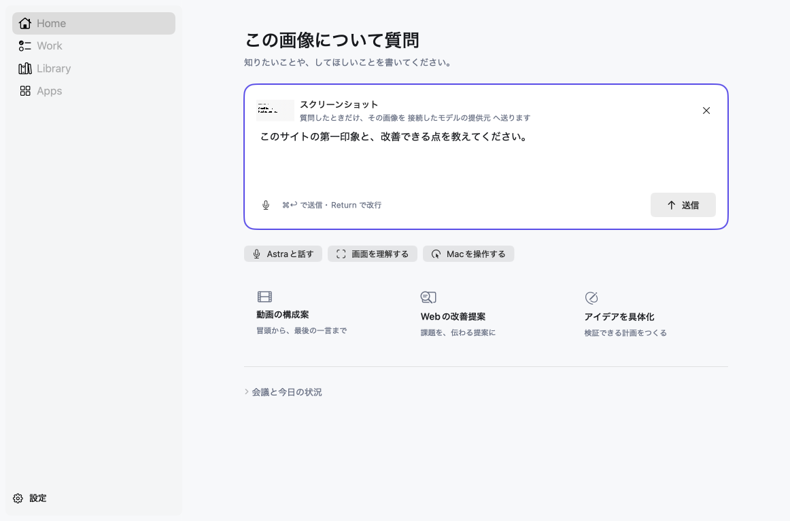

<p align="center"></p>

# Astra

**Your screen. Your next move.**

A native Mac AI workspace. Take a screenshot, ask your own question, and keep the answer with your work. Use a local vision model or connect a supported AI provider.

[Website & demo](https://astra-forifor.forifor.chatgpt.site) · [日本語](docs/README.ja.md) · [Setup](docs/LOCAL_PREVIEW.md) · [Feedback](https://github.com/FORIFOR/astra/issues)



## A small workflow worth keeping

1. Take a Mac screenshot. Astra offers to help with it.
2. Write what **you** want to know. The image is already attached.
3. Send the question. Reopen the answer in Work, copy it, or save it as Markdown.

Try: “What does this error mean?” or “What would you improve on this page?” Screenshot detection itself makes no AI request. The selected image is included when you send your question.

## Bring your model

| Route | What you need                                                   |
| ----- | --------------------------------------------------------------- |
| Local | Ollama with a vision-capable model for image questions          |
| API   | A supported OpenAI-compatible endpoint and your own credentials |
| CLI   | A configured Codex or Claude Code installation                  |

An explicitly selected route is not silently replaced by a paid provider. Local vision keeps the selected image at the local model endpoint. External providers receive the submitted content and may charge for usage; speed and quality vary by model.

## Quick start

**Developer preview — setup is required.** The Mac app currently needs a local gateway, task worker, agent host, and model. The app download alone is not a hosted service.

- macOS 14 or later; native SwiftUI app, Apple silicon and Intel builds.
- [Follow the local setup guide](docs/LOCAL_PREVIEW.md), then try a text request before an image question.
- [Mac builds](https://github.com/FORIFOR/astra/releases): use the build and source version named together in its release notes.
- [See the actual interface and demo](https://astra-forifor.forifor.chatgpt.site/#experience).

The preview includes recording, live transcription, service connections, and guided Mac permissions. Those paths have additional credentials and permissions; they are not prerequisites for the local text workflow. Production-wide release acceptance is still tracked separately from this developer preview.

## Help shape Astra

If this fits how you work, a star helps other people find it. The most useful feedback is a real workflow: what you tried, what you expected, and where Astra got in the way.

- [Report a reproducible problem](https://github.com/FORIFOR/astra/issues/new?template=bug_report.yml).
- [Suggest a workflow or team pilot](https://github.com/FORIFOR/astra/issues/new?template=workflow.yml).
- Read [contribution guidance](CONTRIBUTING.md) before making a change.

Issues are public. Use synthetic examples and remove credentials and personal information. This repository currently has no project-wide open-source license; public visibility is not a license grant. Third-party components retain their own licenses.

## Inside the project

| Directory             | Purpose                                               |
| --------------------- | ----------------------------------------------------- |
| `apps/astra-macos`    | Native SwiftUI Mac app and interaction tests          |
| `apps/windows`        | Native Windows client work                            |
| `core`                | Shared Rust core and native bindings                  |
| `services`            | Gateway, identity, tasks, artifacts, and integrations |
| `workers/agent-host`  | Device-side models and tools                          |
| `workers/task-worker` | Durable task execution                                |
| `packages/contracts`  | Shared Zod contracts                                  |
| `shared/design`       | Design rules and generated tokens                     |
| `docs/evidence`       | Verification records and known limitations            |

The older Tauri client remains under `apps/desktop`; the current Mac interface is `apps/astra-macos`.

```sh
pnpm install
pnpm build
pnpm test
pnpm check:conventions
```

Native and end-to-end checks require additional local dependencies. See [setup](docs/LOCAL_PREVIEW.md), [design rules](shared/design/DESIGN.md), and [`scripts/verify-all.sh`](scripts/verify-all.sh). Product specifications and architecture decisions are indexed in [docs](docs/README.md).
