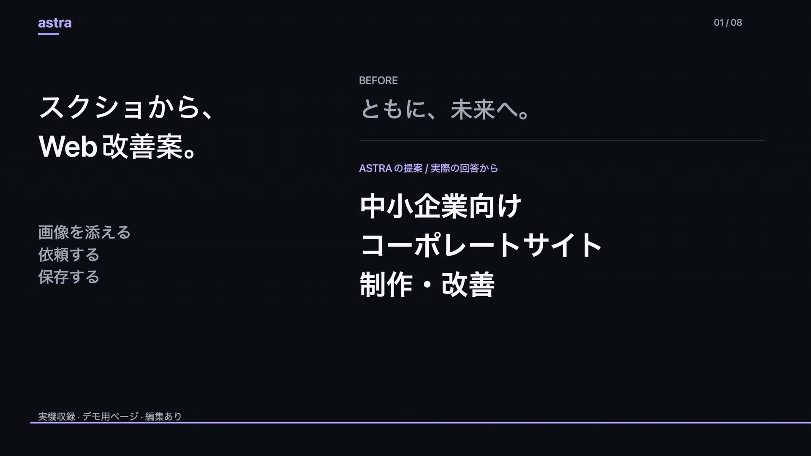

# Astra

**スクショを、提案のたたき台に。**

スクリーンショットを撮り、画像を添えてAIに質問し、答えを仕事として残せるMacアプリです。ローカルの画像モデルや、対応するAIプロバイダーを接続して使います。

[ホームページ・実演](https://astra-forifor.forifor.chatgpt.site) · [English](../README.md) · [セットアップ](LOCAL_PREVIEW.md)

**[30秒の実演を見る](https://youtube.com/shorts/x74kQKDzHsU)** — 架空のWeb制作会社のページで、質問から改善案のMarkdown保存まで実際に操作しました。ローカルモデルの回答は約24秒。待ち時間を短縮しています。[実際の改善案](launch/2026-09-12/v2/PROPOSAL.md)。

1. いつも通りMacでスクリーンショットを撮る。
2. Astraの案内から質問欄を開き、知りたいことを書く。
3. 回答をWorkで開く。コピーやMarkdown保存で、次の作業に使う。

「このエラーはどういう意味？」「このページを改善するなら？」のように、自分の質問を入力できます。撮影を検知しただけではAIに送信しません。質問を送るときに、選択した画像を使います。

**現在は開発者向けプレビューです。** macOS 14以降に対応し、アプリのほかにローカルのGateway・Worker・Agent Host・モデルが必要です。アプリをダウンロードするだけで使えるホスト済みサービスではありません。[セットアップ手順](LOCAL_PREVIEW.md)から始めてください。

Ollamaの画像対応モデル、対応するAPI、Codex、Claude Codeを選択できます。明示的に選んだ経路を、別の有料プロバイダーに自動で切り替えることはありません。速度・回答品質・料金は選んだモデルによって変わります。

録音・ライブ文字起こし・外部サービス連携・Macの権限案内も開発していますが、追加設定が必要です。製品全体のリリース判定と、開発者向けプレビューの公開は別に管理しています。

使いたい場面があれば、[活用提案や試験導入の相談](https://github.com/FORIFOR/astra/issues/new?template=workflow.yml)をお寄せください。公開Issueには、機密情報や認証情報を含めないでください。役立ちそうだと思ったら、GitHubのスターで応援いただけると嬉しいです。

現在、プロジェクト全体に適用するオープンソースライセンスは設定されていません。コードの公開だけでライセンスが付与されるわけではありません。外部コンポーネントには、それぞれのライセンスが適用されます。
